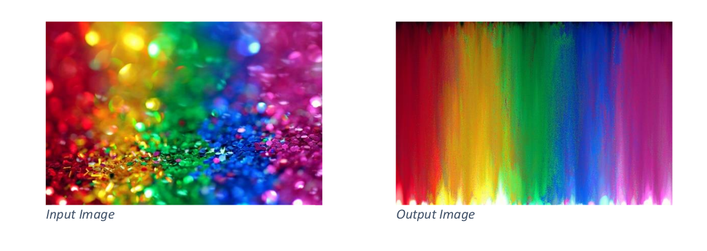

# RGB_ImageSort

### Goals:
- The primary goals of this project are to learn the C++ programming language and become familiar with CMake, Git, and testing units ... 


## Description:

Simple C++ command line application that is able to read and write uncompressed RGB image files in the Bitmap (.bmp) format.


#### Example:



## Prerequisites

- CMake (Versions from 3.3 on should work)
- C++ compiler that supports at least C++11 and that can be found by CMake

## Building 

The following commands should work in a Windows Powershell and in a Linux console provided that CMake is registered to %PATH%

```
cd RGB_ImageSort
mkdir build
cd build
cmake ../
make 
```